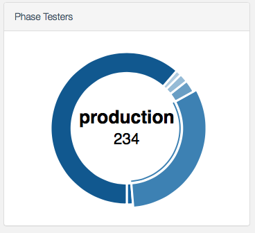
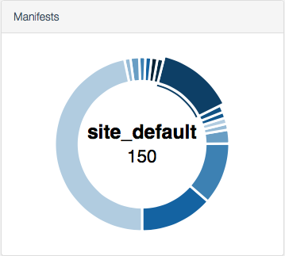

# Sal Plugins
This repository collects the plugins for the Sal management tool that I have
written that are not specific to my employer or environment, nor are part of
the Sal project itself.

## Installation

Clone or copy this project into your Sal plugin directory. The folder must be
named `sheagcraig`, so if git cloning, do `git clone
https://github.com/sheagcraig/sheagcraig_sal_plugins sheagcraig`.  The
advantage of cloning the repo is that you can easily "upgrade" by doing a `git
pull`. If you are concerned about managing those changes, please feel free to
fork the repo.

If you're using the
preferred method of hosting Sal in a Docker container, then bind mounting the
sheagcraig folder or indeed an entire folder of plugins makes sense.

For example,

``` bash
docker run -d --name="sal" \
    --link postgres-sal:db \
	# ...
    --restart=always \
	# Bind mount example:
    -v /usr/local/docker/sal_data/plugins:/home/docker/sal/plugins \
    macadmins/sal:2.7.3
```

Otherwise, copying the `sheagcraig` folder into Sal's plugin folder will work
as well.

The plugins should now be visible from Sal's plugin configuration page.

## Included Plugins
At this time the following plugins are included:

### Catalogs



This plugin provides a donut chart of catalog usage by managed machines.
Machines with multiple catalogs configured will appear in the results for each
of those catalogs. In some environments only the highest-priority catalog is of
interest in terms of classifying a machine's _type_, and plans to offer either
configuration options or an alternate version of the plugin are in the works to
support those environments.

As this plugin relies on a script to be run client-side, machines that have not
checked in with results yet will show up as `Unknown`.

### Manifests



The Manifests plugin looks at each client's `/Library/Managed
Installs/manifests/client_manifest.plist` to determine what
`included_manifests` are configured. Like the Catalogs plugin above, it
provides a donut chart allowing quick machine filtering and reporting based on
included manifest usage.

In my environment, all Macs have a client manifest rather than using a shared
`ClientIdentifier` or `site_default` manifest as the base level of
configuration. Therefore, each additional layer of configuration is applied
with an included manifest, with the hierarchy:

1. `site_default`
2. Site
3. Build

As this plugin relies on a script to be run client-side, machines that have not
checked in with results yet will show up as `Unknown`.

### ManagementCompliance (_unfinished_!)
This plugin is a work in progress to eventually be able to track parameterized
aspects of machine configurations to provide an easy plugin / machine filter
for finding machines that are out of compliance with management policies.
Obviously, this is not as useful in environments where compliance is enforced!
At this time, this plugin only checks for a Munki profile with the identifier:
sas.profiles.munki. This is of course not useful to others without editing.

### Machine Model Bar
This plugin has been contributed to the main Sal project as an alternate to the
Machine Model plugin. It is a bar graph showing more detailed model information
and counts.

### Coming Soon
I'm working on a number of other plugins to meet my needs and to share with Mac
admins. Stay tuned!